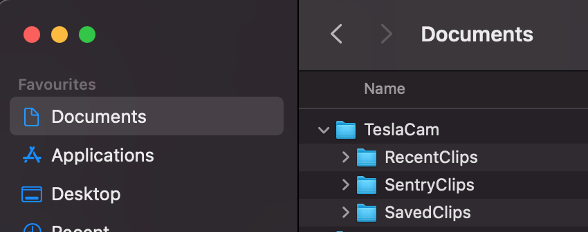

# TeslaVideoCenter

This is :
- a simple application for view the recorded video for the DashCam/Sentry Cam from a Tesla.
- and fun for me to play with AVALONIA.

Currently tested on :
- MacOS x64
- Windows 10

# External source coming from 
 - LibVCLSharp.Avalonia: https://github.com/donandren/vlcsharpavalonia
 - part of the icon: https://thenounproject.com/term/tesla-model-3/487299/
 - FFMepg: https://ffmpeg.org/

# How to use it:
Copy all your files from your USB drive to a TeslaCam folder within your document folder.
For example on my Mac :

# Extra  Technical info

